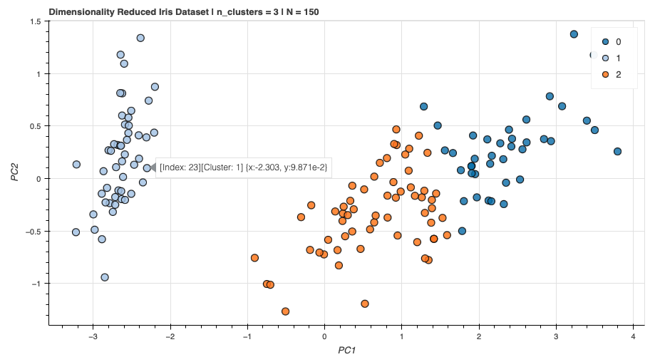

# About this repository 🎨
This repository contains custom defined modules that has been very useful for me during my studies.
For example the bokeh scatterplot, that allows hovering over the data. This is useful to quickly identify
cluster of text data after vectorization and clustering.
```
Note that bokeh uses JavaScript and GitHub does not preview it. 
Therefore, some plots are not visible in the notebooks.
```
### Example: Bokeh Scatterplot
+ Often used in the NLP setting, to allow hovering over vectorized tokens / words
+ Can also be used for simple position reading


